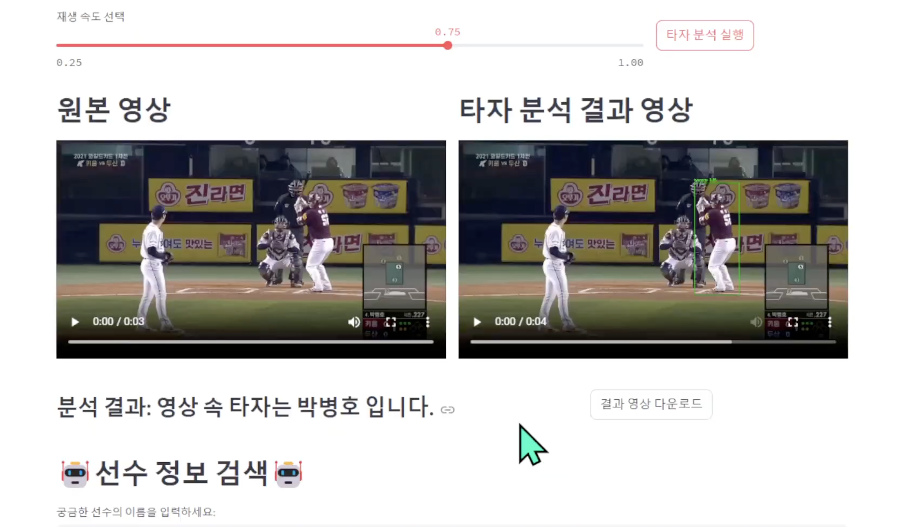

# hitter_detector (DL)
## Project Outline
- 기간: 24.10.28 ~ 24.11.16
- 인원: 2명
- 목표: YOLO를 활용한 타격폼(타자) 분류
- 활용 데이터: KBO 타자 6명의 타격폼 이미지 총 8798장 (자체 수집)
- 사용 모델: YOLOv8n
- 개발 환경: Python 3.10.12, Ultralytics, OpenCV, PyTorch, Streamlit
- 수행 업무: 데이터 라벨링, 모델 훈련, 웹 구현, PPT 제작
- 결과: 내장된 YOLO모델로 타자를 판별하는 웹 사이트 및 실행파일 제작  
       타격폼 영상을 업로드하고 분석 실행 시 타자를 검출한 결과와 타자에 대한 정보 제공
 
🔗 [시연영상 바로가기](https://drive.google.com/file/d/1oJTGiMj7vuNWRfHrawdpsQt-9eZMcTBw/view?usp=sharing)  
🔗 [PPT 바로가기](https://github.com/goguma999/hitter_detector/blob/main/%E1%84%90%E1%85%A1%E1%84%8C%E1%85%A1%E1%84%85%E1%85%B3%E1%86%AF%E1%84%8E%E1%85%A1%E1%86%BD%E1%84%8B%E1%85%A1%E1%84%85%E1%85%A1withYOLO.pdf)

&nbsp;

